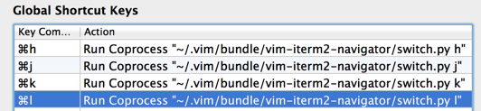

## Vim+iterm2 Seamless Navigation Plugin

Use Cmd+j, Cmd+k, Cmd+l, Cmd+h to seamlessly navigate between your split Vim panes and split iTerm2 panes while editing.

Based on the similar but different [vim-tmux-navigator](https://github.com/christoomey/vim-tmux-navigator) plugin. I wanted to do the same for my native split panes in iTerm, which means using AppleScript...

This plugin is for developers using cli-mode Vim (not MacVim) inside an iTerm2 window, dealing with lots of split panes.

#### To Install:

Add this repo to your bundles.

    cd ~/.vim/bundle
    git clone git://github.com/zephod/vim-iterm2/navigator

Now configure iTerm2's keyboard shortcuts. **Cmd-J** should be set to **run coprocess**. This coprocess is `~/.vim/bundle/vim-iterm2-navigator/switch.py j`. Note the argument passed to the script.  Screenshot of settings:

---

Developer Note: This is how I created the applescript/\* files:

    osacompile -o iterm2_l.scpt -e "tell application \"System Events\" to key code 124 using {command down, option down}"
    osacompile -o iterm2_h.scpt  -e "tell application \"System Events\" to key code 123 using {command down, option down}"
    osacompile -o iterm2_k.scpt    -e "tell application \"System Events\" to key code 126 using {command down, option down}"
    osacompile -o iterm2_j.scpt  -e "tell application \"System Events\" to key code 125 using {command down, option down}"
    osacompile -o iterm2_getname.scpt -e "
      tell application \"iTerm\"
        activate
        tell the current terminal
          tell the current session
            get name 
          end tell
        end tell
      end tell"

